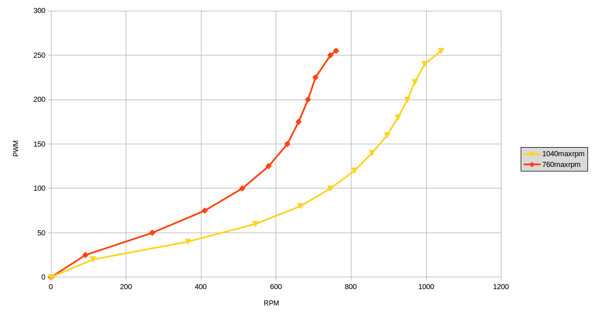

# ML for DC_Motor_Control

A polynomial regression algorithm to stabilize the error between the User-given and Sensed-speed under no load and loaded conditions for a 12 V DC motor.

### Conventional method

I guess some "Electronics" stuff.

### Deploying Machine Learning 
 The behaviour of the DC motor is polymial as observed from the graph below.

<figure>
	
	<figcaption> 
RPM vs PWM of 2 different 12V DC motors.
 </figcaption>
</figure>

The similar behaviour of the graphs of motors of different specifications leads to the assumption that different motors behave almost similarly and that the graph of any other DC motor can be mapped on to the base polynomial function found.
* Obtain the coefficients of the polynomial function using polynomial regression.
* Recreate the function in arudino.

### Future work
Make polynomial regression compatible with arduino.
